

<!-- Banner: lo genera scripts/banner.py -->
<a href="https://adicodev.com">
  <picture>
    <source media="(prefers-color-scheme: dark)" srcset="assets/banner-dark.svg">
    <source media="(prefers-color-scheme: light)" srcset="assets/banner-light.svg">
    
  </picture>
</a>

---

## `$ whoami`

  

 

## `$ cat stack.yaml`

<table>
  <thead>
    <tr>
      <th colspan="2" align="left"><code>ad1code:~$ cat stack.yaml</code></th>
    </tr>
  </thead>
  <tbody>
    <tr>
      <td width="50%" valign="top"><code>├─ agentes:</code>  
        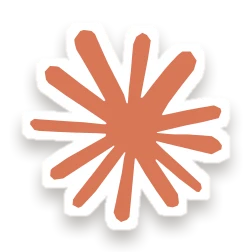
        
        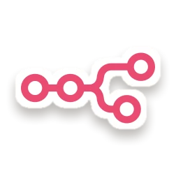 
        <code>Claude Code · MCP · n8n</code>
      </td>
      <td width="50%" valign="top"><code>├─ vision:</code>  
        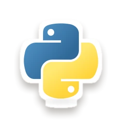
        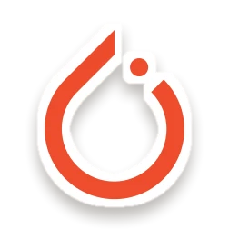
        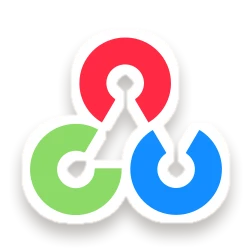
        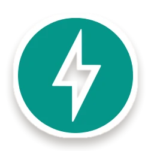 
        <code>Python · PyTorch · OpenCV · FastAPI</code>
      </td>
    </tr>
    <tr>
      <td valign="top"><code>├─ producto:</code>  
        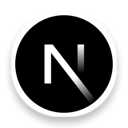
        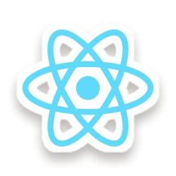
        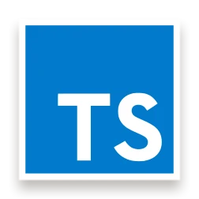
        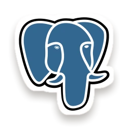 
        <code>Next.js · React · TypeScript · PostgreSQL</code>
      </td>
      <td valign="top"><code>╰─ infra:</code>  
        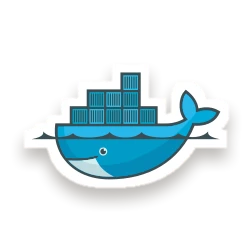
         
        <code>Docker · Linux</code>
      </td>
    </tr>
  </tbody>
  <tfoot>
    <tr>
      <td colspan="2"><code>los repos de estos proyectos son privados  ·  el detalle, en adicodev.com</code></td>
    </tr>
  </tfoot>
</table>

---

## `$ du --por-lenguaje`

  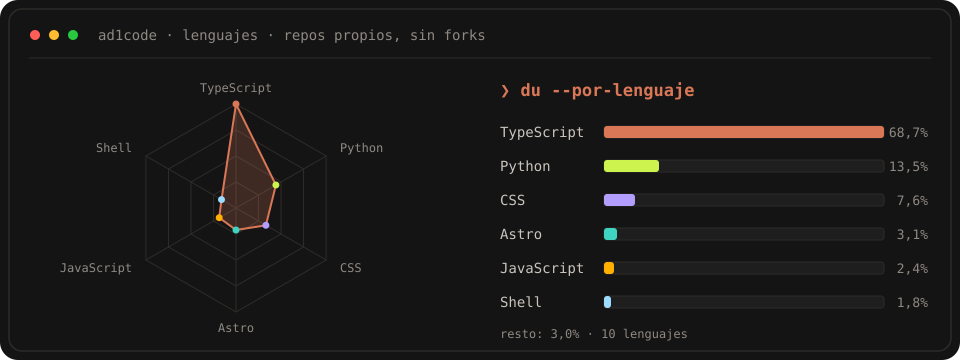

---

## `$ git log --graph`

<!-- La genera .github/workflows/snake.yml cada 12 h en la rama `output` -->

  <picture>
    <source media="(prefers-color-scheme: dark)" srcset="https://raw.githubusercontent.com/ad1code/ad1code/output/github-snake-dark.svg">
    <source media="(prefers-color-scheme: light)" srcset="https://raw.githubusercontent.com/ad1code/ad1code/output/github-snake.svg">
    
  </picture>

---

## `$ contacto`

&nbsp;&nbsp;
&nbsp;&nbsp;

